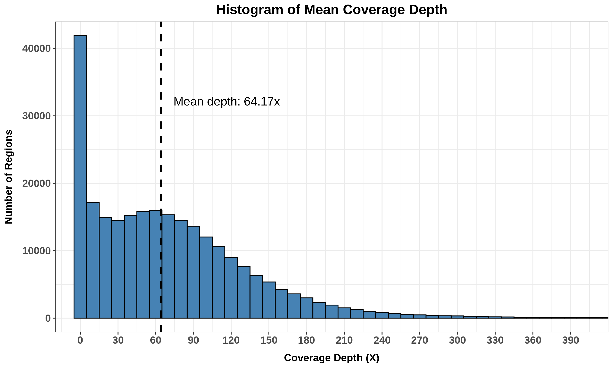
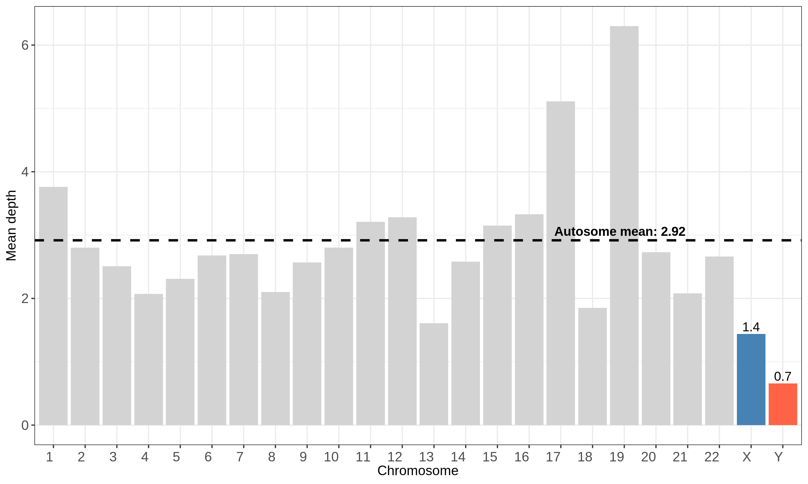

# WES-QC: Controle de Qualidade para Sequenciamento de Exoma Completo
  

# Pipeline de Controle de Qualidade WES

Pipeline automatizado de controle de qualidade para dados de Whole Exome Sequencing (WES), com foco no cálculo de cobertura, inferência de sexo genético e estimativa de contaminação. Este projeto faz parte de um desafio técnico com base na amostra NA06994 do 1000 Genomes Project.

## Autor
👨🏽‍💻 Alexandre Junio Borges Araujo  
📧 alexandrejuniob96@gmail.com  
▶️ [LinkedIn/Alexandre_Borges](https://www.linkedin.com/in/alexandre-borges-57bb14150/)

## 🔬 Amostra utilizada
 
Este pipeline foi implementado utilizando a amostra descrita abaixo, porém sua estrutura automatizada permite a aplicação a qualquer outra amostra, desde que os arquivos de entrada exigidos estejam devidamente disponibilizados (ver seção: 'Preparação — Download dos arquivos necessários').

- **Nome**: NA06994
- **Origem**: Projeto 1000 Genomes – CEU
- **Formato**: `.cram` + `.crai`
- **Referência**: GRCh38_full_analysis_set_plus_decoy_hla.fa
---

## (Preparação) - Criação do diretório e configuração dos ambientes necessários  
Não é necessário clonar este repositório principal para executar o projeto. Basta executar o script [setup_project.sh](setup_project.sh), que irá configurar automaticamente o ambiente, criar a estrutura mínima de diretórios e baixar os scripts necessários para a execução do pipeline.

**Configuração dos ambientes necessários 🖥️:**  
* _wes_qc_env_ — r-base=4.2.2, r-ggplot2, r-dplyr, r-stringr, r-readr, r-data.table e mosdepth.
* _verifybamid_env_ — verifybamid.

**A estrutura mínima do diretório 📁:**    
wes_challenge_incor/  
├── data/                            
├── logs/                        
├── results/                                         
└── scripts/     

**Scripts necessários 📄:**  
└── scripts  
│   ├── contamination_verifybamid.sh  
│   ├── convert_cram_to_bam.sh  
│   ├── coverage_mosdepth.sh  
│   ├── coverage_summary_and_histogram.R  
│   ├── download_all.sh  
│   ├── run_pipeline.sh  
│   └── sex_inference.R  

Informações detalhadas sobre os scripts podem ser encontradas nas próximas seções  

---
## (Preparação) — Download dos arquivos necessários
Para a execução do pipeline com a amostra NA06994, foram necessários de seis arquivos públicos obtidos a partir de repositórios oficiais. Ambos foram baixados com script abaixo e armazenados na pasta _data/_.

**Ambiente:**  
wes_qc_env  

**Diretório de Execução:**  
wes_challenge_incor

**Script ▶️:**  
[download_all.sh](scripts/download_all.sh)  
`./scripts/download_all.sh`

**Arquivo de alinhamento (.cram):** [GRCh38DH.20150826.CEU.exome.cram](http://ftp.1000genomes.ebi.ac.uk/vol1/ftp/data_collections/1000_genomes_project/data/CEU/NA06994/exome_alignment/NA06994.alt_bwamem_GRCh38DH.20150826.CEU.exome.cram)  
**Índice do alinhamento (.cram.crai):** [GRCh38DH.20150826.CEU.exome.cram.crai](http://ftp.1000genomes.ebi.ac.uk/vol1/ftp/data_collections/1000_genomes_project/data/CEU/NA06994/exome_alignment/NA06994.alt_bwamem_GRCh38DH.20150826.CEU.exome.cram.crai)  
**Arquivo de regiões exônicas (.bed):** [hg38_exome_v2.0.2_targets_validated.re_annotated.bed](https://www.twistbioscience.com/sites/default/files/resources/2022-12/hg38_exome_v2.0.2_targets_sorted_validated.re_annotated.bed)  
**Genoma de referência (.fa):** [GRCh38_full_analysis_set_plus_decoy_hla.fa](https://ftp.1000genomes.ebi.ac.uk/vol1/ftp/technical/reference/GRCh38_reference_genome/GRCh38_full_analysis_set_plus_decoy_hla.fa)  
**Arquivo Variant Call Format (.vcf):** [hapmap_3.3.hg38.vcf.gz](https://storage.googleapis.com/genomics-public-data/resources/broad/hg38/v0/hapmap_3.3.hg38.vcf.gz)  
**Índice do VFC:** [hapmap_3.3.hg38.vcf.gz.tbi](https://storage.googleapis.com/genomics-public-data/resources/broad/hg38/v0/hapmap_3.3.hg38.vcf.gz.tbi)

A integridade dos arquivos baixados foi realizada por meio da comparação de seus hashes MD5 com as respectivas impressões digitais:

**Arquivo .cram:** 3d8d8dc27d85ceaf0daefa493b8bd660  
**Arquivo .cram.crai:** 15a6576f46f51c37299fc004ed47fcd9  
**Arquivo .bed:** c3a7cea67f992e0412db4b596730d276

**Log gerado na amostra NA06994 [download_files.log](logs/download_files.log):**  
```
[Fri May 30 14:05:33 -03 2025] Starting download script...
[Fri May 30 14:05:33 -03 2025] Downloading reference genome (GRCh38 + decoy + HLA)...
--2025-05-30 14:05:33--  https://ftp.1000genomes.ebi.ac.uk/vol1/ftp/technical/reference/GRCh38_reference_genome/GRCh38_full_analysis_set_plus_decoy_hla.fa
Resolving ftp.1000genomes.ebi.ac.uk (ftp.1000genomes.ebi.ac.uk)... 193.62.193.167
Connecting to ftp.1000genomes.ebi.ac.uk (ftp.1000genomes.ebi.ac.uk)|193.62.193.167|:443... connected.
HTTP request sent, awaiting response... 200 OK
Length: 3263683042 (3.0G)
Saving to: ‘GRCh38_full_analysis_set_plus_decoy_hla.fa’

GRCh38_full_analysi 100%[===================>]   3.04G  9.74MB/s    in 4m 12s

2025-05-30 14:09:48 (12.3 MB/s) - ‘GRCh38_full_analysis_set_plus_decoy_hla.fa’ saved [3263683042/3263683042]

[Fri May 30 14:09:48 -03 2025] Indexing reference genome...
[Fri May 30 14:10:01 -03 2025] Downloading alignment files (CRAM and CRAI)...
--2025-05-30 14:10:01--  http://ftp.1000genomes.ebi.ac.uk/vol1/ftp/data_collections/1000_genomes_project/data/CEU/NA06994/exome_alignment/NA06994.alt_bwamem_GRCh38DH.20150826.CEU.exome.cram
Resolving ftp.1000genomes.ebi.ac.uk (ftp.1000genomes.ebi.ac.uk)... 193.62.193.167
Connecting to ftp.1000genomes.ebi.ac.uk (ftp.1000genomes.ebi.ac.uk)|193.62.193.167|:80... connected.
HTTP request sent, awaiting response... 200 OK
Length: 2988269180 (2.8G)
Saving to: ‘NA06994.alt_bwamem_GRCh38DH.20150826.CEU.exome.cram’

NA06994.alt_bwamem_ 100%[===================>]   2.78G  14.1MB/s    in 4m 4s

2025-05-30 14:14:06 (11.7 MB/s) - ‘NA06994.alt_bwamem_GRCh38DH.20150826.CEU.exome.cram’ saved [2988269180/2988269180]

--2025-05-30 14:14:06--  http://ftp.1000genomes.ebi.ac.uk/vol1/ftp/data_collections/1000_genomes_project/data/CEU/NA06994/exome_alignment/NA06994.alt_bwamem_GRCh38DH.20150826.CEU.exome.cram.crai
Resolving ftp.1000genomes.ebi.ac.uk (ftp.1000genomes.ebi.ac.uk)... 193.62.193.167
Connecting to ftp.1000genomes.ebi.ac.uk (ftp.1000genomes.ebi.ac.uk)|193.62.193.167|:80... connected.
HTTP request sent, awaiting response... 200 OK
Length: 234297 (229K)
Saving to: ‘NA06994.alt_bwamem_GRCh38DH.20150826.CEU.exome.cram.crai’

NA06994.alt_bwamem_ 100%[===================>] 228.81K   272KB/s    in 0.8s

2025-05-30 14:14:07 (272 KB/s) - ‘NA06994.alt_bwamem_GRCh38DH.20150826.CEU.exome.cram.crai’ saved [234297/234297]

[Fri May 30 14:14:07 -03 2025] Downloading BED file (Twist Exome v2.0.2)...
--2025-05-30 14:14:07--  https://www.twistbioscience.com/sites/default/files/resources/2022-12/hg38_exome_v2.0.2_targets_sorted_validated.re_annotated.bed
Resolving www.twistbioscience.com (www.twistbioscience.com)... 104.18.247.53, 104.18.248.53, 2606:4700::6812:f735, ...
Connecting to www.twistbioscience.com (www.twistbioscience.com)|104.18.247.53|:443... connected.
HTTP request sent, awaiting response... 200 OK
Length: 87562966 (84M) [application/vnd.realvnc.bed]
Saving to: ‘hg38_exome_v2.0.2_targets_sorted_validated.re_annotated.bed’

hg38_exome_v2.0.2_t 100%[===================>]  83.51M   100MB/s    in 0.8s

2025-05-30 14:14:08 (100 MB/s) - ‘hg38_exome_v2.0.2_targets_sorted_validated.re_annotated.bed’ saved [87562966/87562966]

[Fri May 30 14:14:08 -03 2025] Downloading VCF file and its index (HapMap 3.3, hg38)...
--2025-05-30 14:14:08--  https://storage.googleapis.com/genomics-public-data/resources/broad/hg38/v0/hapmap_3.3.hg38.vcf.gz
Resolving storage.googleapis.com (storage.googleapis.com)... 142.250.219.251, 172.217.29.123, 142.250.78.123, ...
Connecting to storage.googleapis.com (storage.googleapis.com)|142.250.219.251|:443... connected.
HTTP request sent, awaiting response... 200 OK
Length: 62043448 (59M) [text/x-vcard]
Saving to: ‘hapmap_3.3.hg38.vcf.gz’

hapmap_3.3.hg38.vcf 100%[===================>]  59.17M  18.7MB/s    in 3.2s

2025-05-30 14:14:12 (18.7 MB/s) - ‘hapmap_3.3.hg38.vcf.gz’ saved [62043448/62043448]

--2025-05-30 14:14:12--  https://storage.googleapis.com/genomics-public-data/resources/broad/hg38/v0/hapmap_3.3.hg38.vcf.gz.tbi
Resolving storage.googleapis.com (storage.googleapis.com)... 172.217.29.91, 172.217.29.123, 172.217.30.91, ...
Connecting to storage.googleapis.com (storage.googleapis.com)|172.217.29.91|:443... connected.
HTTP request sent, awaiting response... 200 OK
Length: 1552123 (1.5M) [application/octet-stream]
Saving to: ‘hapmap_3.3.hg38.vcf.gz.tbi’

hapmap_3.3.hg38.vcf 100%[===================>]   1.48M  1.67MB/s    in 0.9s

2025-05-30 14:14:13 (1.67 MB/s) - ‘hapmap_3.3.hg38.vcf.gz.tbi’ saved [1552123/1552123]

[Fri May 30 14:14:13 -03 2025] Verifying file integrity with MD5...
NA06994.alt_bwamem_GRCh38DH.20150826.CEU.exome.cram: OK
NA06994.alt_bwamem_GRCh38DH.20150826.CEU.exome.cram.crai: OK
hg38_exome_v2.0.2_targets_sorted_validated.re_annotated.bed: OK
[Fri May 30 14:14:19 -03 2025] Download, indexing and verification completed successfully!
```

---
## 🔁 Automação

O script [run_pipeline.sh](run_pipeline.sh) executa automaticamente todas as etapas do pipeline de controle de qualidade. Ele pode ser utilizado para processar múltiplas amostras e permite a definição do número de núcleos de processamento a ser utilizado (caso especificado).

### 🔧 O que ele faz:

1. Calcula a cobertura com o mosdepth para cada _.cram_ em _data/_  
2. Executa a análise exploratória de cobertura e gera histogramas com R  
3. Realiza a inferência de sexo genético com base na razão de cobertura dos cromossomos X e Y  
4. Converte arquivos _.cram_ para _.bam_ e gera os arquivos _.bai_  
5. Estima a contaminação usando _verifyBamID_
6. Identificação de possíveis erros
   
### ▶️ Como executar:
**Ambiente:**  
wes_qc_env 

**Diretório de Execução:**  
wes_challenge_incor

**Script:**  
[run_pipeline.sh](scripts/run_pipeline.sh)  
`./scripts/run_pipeline.sh <Número de núcleos de processamento>`

Cada etapa do pipeline é descrita a seguir e pode ser executada isoladamente a partir do diretório principal wes_challenge_incor!

---
## Análise de Cobertura do Exoma com Mosdepth 
Esta etapa realiza o cálculo da cobertura de regiões exônicas utilizando o software _Mosdepth_ e em seguida (separadamente), a análise exploratória dos resultados em R.  

### Cálculo de Cobertura com Mosdepth
O cálculo da cobertura das regiões exônicas foi realizado utilizando como entrada o arquivo _.cram_ da amostra, o arquivo _.bed_ com as regiões-alvo do exoma e o genoma de referência completo (incluindo decoy e regiões HLA).

**Ambiente:**  
wes_qc_env

**Estrutura Esperada para Execução 📁:**  
wes_challenge_incor/  
├── data/  
│   ├── NA06994.alt_bwamem_GRCh38DH.20150826.CEU.exome.cram       
│   ├── NA06994.alt_bwamem_GRCh38DH.20150826.CEU.exome.cram.crai   
│   ├── GRCh38_full_analysis_set_plus_decoy_hla.fa               
│   ├── GRCh38_full_analysis_set_plus_decoy_hla.fa.fai           
│   └── hg38_exome_v2.0.2_targets_sorted_validated.re_annotated.bed  
│  
├── scripts/  
│   └── coverage_mosdepth.sh  
│  
├── results/  
├── logs/   

**Script ▶️:**  
[coverage_mosdepth.sh](scripts/coverage_mosdepth.sh)  
`./scripts/coverage_mosdepth.sh`

**Log gerado para amostra NA06994 [mosdepth.log](logs/NA06994.alt_bwamem_GRCh38DH.20150826.CEU.exome_mosdepth.log):**  
```
→ CRAM: data/NA06994.alt_bwamem_GRCh38DH.20150826.CEU.exome.cram  
→ BED: data/hg38_exome_v2.0.2_targets_sorted_validated.re_annotated.bed  
→ Reference: data/GRCh38_full_analysis_set_plus_decoy_hla.fa  
→ Output Prefix: results/NA06994.alt_bwamem_GRCh38DH.20150826.CEU.exome_mosdepth  
[Fri May 30 11:16:47 -03 2025] Coverage calculation completed for NA06994.alt_bwamem_GRCh38DH.20150826.CEU.exome  
```

**Resultados gerados para amostra NA06994**  
results/NA06994.alt_bwamem_GRCh38DH.20150826.CEU.exome.mosdepth.global.dist.txt  
results/NA06994.alt_bwamem_GRCh38DH.20150826.CEU.exome.mosdepth.region.dist.txt  
results/NA06994.alt_bwamem_GRCh38DH.20150826.CEU.exome.mosdepth.summary.txt  
results/NA06994.alt_bwamem_GRCh38DH.20150826.CEU.exome.per-base.bed.gz  
results/NA06994.alt_bwamem_GRCh38DH.20150826.CEU.exome.per-base.bed.gz.csi  
results/NA06994.alt_bwamem_GRCh38DH.20150826.CEU.exome.regions.bed.gz  
results/NA06994.alt_bwamem_GRCh38DH.20150826.CEU.exome.regions.bed.gz.csi  

### Análise Exploratória da Cobertura
A análise exploratória foi realizada com funções nativas da linguagem R, utilizando como entrada o arquivo _.bed.gz_ gerado pelo _Mosdepth_. O script calcula métricas estatísticas de cobertura e gera uma visualização gráfica da distribuição dos dados.

**Ambiente:**  
wes_qc_env

**Estrutura Esperada para Execução 📁:**  
wes_challenge_incor/  
├── results/  
│   └── NA06994.regions.bed.gz  
│  
├── scripts/  
│   └── exploratory_analysis_coverage.R   
│  
├── logs/         

**Script ▶️:**  
[coverage_summary_and_histogram.R](scripts/coverage_summary_and_histogram.R)  
`Rscript scripts/exploratory_analysis_coverage.R results/NA06994.regions.bed.gz`

**Log gerado para amostra NA06994 [exploratory_analysis.log](logs/NA06994.alt_bwamem_GRCh38DH.20150826.CEU.exome_exploratory_analysis.log):**  

```
Warning messages:
1: package ‘ggplot2’ was built under R version 4.2.3
2: package ‘readr’ was built under R version 4.2.3
3: package ‘dplyr’ was built under R version 4.2.3
[INFO] Reading file: results/NA06994.alt_bwamem_GRCh38DH.20150826.CEU.exome.regions.bed.gz
[INFO] Calculating coverage statistics...
[INFO] Summary written to: results/exploratory_analysis_coverage.csv
========== Coverage Summary =========
                           metric      value
1                      Mean Depth   64.16930
2                   Minimum Depth    0.00000
3                   Maximum Depth 3371.81000
4 Regions with Coverage ≥ 10x (%)   71.76290
5 Regions with Coverage ≥ 30x (%)   61.21708
======================================
[INFO] Generating histogram plot...
Warning message:
Using `size` aesthetic for lines was deprecated in ggplot2 3.4.0.
ℹ Please use `linewidth` instead.
[INFO] Histogram saved to: results/histogram_coverage.png
```

**Resultados gerados para a amostra NA06994:**  
exploratory_analysis_coverage.csv   
histogram_coverage.png  
  

**CONCLUSÃO:**  
A amostra apresentou uma profundidade média de 64,17×, indicando cobertura robusta para análise de variantes em regiões exônicas. Além disso, 71,76% das regiões apresentaram cobertura igual ou superior a 10×, e 61,22% foram cobertas por pelo menos 30×, valores que indicam boa qualidade para chamadas de variantes com alta confiança. Apesar de adequada, a cobertura não é uniforme, o que reforça a importância de avaliar graficamente a distribuição.

---
## Inferência do Sexo Genético
A inferência de sexo genético foi realizada com base na cobertura dos cromossomos sexuais, utilizando os arquivos de saída do _mosdepth_ (_.mosdepth.summary.txt_). Diferentemente de abordagens baseadas exclusivamente no exoma, este método considera a cobertura de todos os cromossomos (X e Y) em comparação à cobertura média dos autossomos. A classificação é realizada por meio de limiares empíricos fixos aplicados à razão entre cobertura dos cromossomos sexuais e autossomos como ocorre em ferramentas como o seGMM (Liu et al. 2022). Entretanto, o seGMM também utiliza inferência bayesiana para melhor acurácia, o que não foi necessário nesse pipeline. 

**Ambiente:**  
wes_qc_env

**Estrutura Esperada para Execução 📁:**  
wes_challenge_incor/  
├── results/  
│   └── NA06994.mosdepth.summary.txt   
│  
├── scripts/  
│   └── sex_inference.R    
│  
├── logs/  

**Script ▶️:**  
[sex_inference.R](scripts/sex_inference.R)  
`Rscript scripts/sex_inference.R <results/<sample>.mosdepth.summary.txt>`

**Lógicas de Classificação Utilizadas:**  
chrX ≈ 2× autosomos, chrY ≈ 0 =	Female (XX)  
chrX ≈ 1× autosomos, chrY ≈ 1× autosomos	= Male (XY)  
chrX ≈ 2× autosomos, chrY elevado	= Possível aneuploidia (XXY)  
chrX ≈ 1× autosomos, chrY ≈ 0	= Possível aneuploidia (X0)  
Caso intermediário ou ambíguo	= Indeterminado  

x_female_lower_threshold <- 0.8  
x_male_upper_threshold <- 0.6  
y_male_lower_threshold <- 0.1  

**Log gerado na amostra NA06994 [chrXY_coverage.log](NA06994.alt_bwamem_GRCh38DH.20150826.CEU.exome_chrXY_coverage.log):**   
```
Warning messages:
1: package ‘ggplot2’ was built under R version 4.2.3
2: package ‘readr’ was built under R version 4.2.3
3: package ‘dplyr’ was built under R version 4.2.3
4: package ‘stringr’ was built under R version 4.2.3
[INFO] Reading coverage file: results/NA06994.alt_bwamem_GRCh38DH.20150826.CEU.exome.mosdepth.summary.txt
=== Genetic Sex Inference ===
Sample: NA06994.alt_bwamem_GRCh38DH.20150826.CEU.exome
Average autosome coverage: 2.92
chrX coverage: 1.44 ( 0.49 x autosomes)
chrY coverage: 0.66 ( 0.23 x autosomes)
Inferred sex: Male (XY)
Plot saved to: results/NA06994.alt_bwamem_GRCh38DH.20150826.CEU.exome_chrXY_coverage.png
```

**Resultados gerados na amostra NA06994 [chrXY_coverage.png](results/NA06994.alt_bwamem_GRCh38DH.20150826.CEU.exome_chrXY_coverage.png):**  
  

**CONCLUSÃO:**  
A razão entre a cobertura do cromossomo X e os autossomos foi de 0,49, indicando a presença de apenas um cromossomo X. A cobertura observada no cromossomo Y foi de 0,23× em relação aos autossomos, sugerindo a presença do cromossomo Y. Com base nesses valores, a amostra NA06994 foi classificada como tendo sexo genético masculino (XY).

---
## Verificação de Contaminação verifyBamID.
O verifyBamID foi escolhido para a estimativa de contaminação por ser uma ferramenta amplamente validada para dados de sequenciamento humano, com desempenho eficiente na detecção de DNA exógeno. Seu algoritmo compara os alelos observados nos arquivos BAM com variantes conhecidas presentes em arquivos VCF públicos, como o HapMap 3.3, e estima a fração de contaminação (FREEMIX) com base em modelos estatísticos. Essa abordagem permite identificar níveis baixos de contaminação sem a necessidade de genótipos de controle, sendo especialmente adequada para análises automatizadas e em larga escala. Além disso, o verifyBamID apresenta baixa demanda computacional e compatibilidade com múltiplas amostras, o que o torna uma opção robusta para controle de qualidade inicial em pipelines de WES.

Como o verifyBamID necessita de arquivos .bam. Foram realizados os dois processos consecutivos:  
* Conversão de arquivos _.cram_ para _.bam_ com indexação  
* Verificação de contaminação genômica com _verifyBamID2_  

Todos os scripts estão organizados no diretório scripts/. As saídas são organizadas em logs/ e results/.

### Conversão de CRAM para BAM
Arquivos _.cram_ de amostras de exoma são convertidos para .bam com uso de referência genômica completa. Cada _.bam_ é também indexado (_.bai_) e os logs são salvos separadamente.

**Ambiente:**  
wes_qc_env

**strutura Esperada para Execução 📁:**  
wes_challenge_incor/  
├── data/  
│   ├── NA06994.alt_bwamem_GRCh38DH.20150826.CEU.exome.cram      
│   ├── GRCh38_full_analysis_set_plus_decoy_hla.fa              
│   └── GRCh38_full_analysis_set_plus_decoy_hla.fa.fai         
│  
├── scripts/  
│   └── convert_cram_to_bam.sh                               
│  
├── results/                                                    
│  
├── logs/      

**Script ▶️:**  
[convert_cram_to_bam.sh](scripts/convert_cram_to_bam.sh)  
`./scripts/convert_cram_to_bam.sh`

**Log gerado na amostra NA06994 [converted_cram_to_bam.log](logs/converted_cram_to_bam.log):**  
```
Converting NA06994.alt_bwamem_GRCh38DH.20150826.CEU.exome...  
[Sat May 17 21:33:45 -03 2025] Starting CRAM to BAM conversion: data/NA06994.alt_bwamem_GRCh38DH.20150826.CEU.exome.cram  
[Sat May 17 21:34:52 -03 2025] Indexing BAM: data/NA06994.alt_bwamem_GRCh38DH.20150826.CEU.exome.bam  
[Sat May 17 21:35:29 -03 2025] Conversion and indexing completed successfully.  
BAM generated: data/NA06994.alt_bwamem_GRCh38DH.20150826.CEU.exome.bam  
All CRAM files have been converted.
```

**Resultados gerados na amostra NA06994:**  
NA06994.alt_bwamem_GRCh38DH.20150826.CEU.exome  
NA06994.alt_bwamem_GRCh38DH.20150826.CEU.exome.bam.bai  


### Verificação de Contaminação com verifyBamID

**Ambiente:**  
verifybamID_env

**Estrutura Esperada para Execução 📁:**  
wes_challenge_incor/  
├── data/  
│   ├── NA06994.bam                            
│   ├── NA06994.bam.bai                         
│   ├── hapmap_filtered.vcf.gz                   
│   ├── hapmap_filtered.vcf.gz.csi                
│  
├── scripts/  
│   └── contamination_verifybamid.sh            
│  
├── results/                                    
│  
├── logs/      

 
**Script ▶️:**  
[contamination_verifybamid.sh](scripts/contamination_verifybamid.sh)  
`./scripts/contamination_verifybamid.sh` 

**Log gerado na amostra NA06994 [automation_verifybamid.log](logs/NA06994.alt_bwamem_GRCh38DH.20150826.CEU.exome_automation_verifybamid.log):**  
```
[Fri May 30 11:16:54 -03 2025] Filtered VCF already exists. Skipping filtering.
[Fri May 30 11:16:54 -03 2025] Starting sample: NA06994.alt_bwamem_GRCh38DH.20150826.CEU.exome
[Fri May 30 11:16:54 -03 2025] Running verifyBamID for NA06994.alt_bwamem_GRCh38DH.20150826.CEU.exome...

Available Options
                             Input Files : --vcf [data/hapmap_filtered.vcf.gz],
                                           --bam [data/NA06994.alt_bwamem_GRCh38DH.20150826.CEU.exome.bam],
                                           --bai [], --subset [], --smID []
                    VCF analysis options : --genoError [1.0e-03],
                                           --minAF [0.01],
                                           --minCallRate [0.50]
   Individuals to compare with chip data : --site, --self, --best
          Chip-free optimization options : --free-none, --free-mix [ON],
                                           --free-refBias, --free-full
          With-chip optimization options : --chip-none, --chip-mix [ON],
                                           --chip-refBias, --chip-full
                    BAM analysis options : --ignoreRG [ON],
                                           --ignoreOverlapPair, --noEOF,
                                           --precise [ON], --minMapQ [10],
                                           --maxDepth [100], --minQ [13],
                                           --maxQ [40], --grid [0.05]
                 Modeling Reference Bias : --refRef [1.00], --refHet [0.50],
                                           --refAlt [0.00]
                          Output options : --out [results/NA06994.alt_bwamem_GRCh38DH.20150826.CEU.exome_verifybam],
                                           --verbose
                               PhoneHome : --noPhoneHome,
                                           --phoneHomeThinning [50]

WARNING : Skipping no-autosomal marker chrX:233451
WARNING : Skipping no-autosomal marker chrX:238008
WARNING : Skipping no-autosomal marker chrX:238086
WARNING : Skipping no-autosomal marker chrX:253138
WARNING : Skipping no-autosomal marker chrX:253255
verifyBamID 1.1.3 -- verify identity and purity of sequence data
(c) 2010-2014 Hyun Min Kang, Goo Jun, and Goncalo Abecasis


WARNING -
--self option was autotomatically turned on by default. Specify --best option if you wanted to check across all possible samples in the VCF
[Fri May 30 12:12:35 -03 2025] Completed: results/NA06994.alt_bwamem_GRCh38DH.20150826.CEU.exome_verifybam.selfSM
[Fri May 30 12:12:35 -03 2025] All analyses completed.
```
**Resultados gerados na amostra NA06994:**  
results/NA06994.alt_bwamem_GRCh38DH.20150826.CEU.exome_verifybam.log  
results/NA06994.alt_bwamem_GRCh38DH.20150826.CEU.exome_verifybam.depthSM  
results/NA06994.alt_bwamem_GRCh38DH.20150826.CEU.exome_verifybam.selfSM  

**Descrição dos arquivos gerados:**   
verifybam.log: Log gerado pela execução interna do verifybam. Arquivo mais detalhado que o log padrão.
verifybam.depthSM: Registro da profundidade de cobertura (DP) da amostra em cada posição do VCF analisado. É útil para diagnósticos e para entender a distribuição da profundidade nas regiões genotipadas.  
verifybam.selfSM: Registro das estimativas de contaminação genômica e ancestralidade da amostra, com base na comparação entre o BAM analisado e o painel de variantes de referência (VCF). A coluna _FREEMIX_ determina a fração estimada de contaminação.  

**CONCLUSÃO:**  
A amostra NA06994 apresentou uma estimativa de contaminação (_FREEMIX_) de 0,00035, ou seja, 0,035%. Esse valor está muito abaixo do limite de tolerância geralmente aceito (2%), indicando que não há evidência de contaminação significativa na amostra. Portanto, os dados podem ser considerados confiáveis para análises genômicas subsequentes.

---
## Referências:
Liu, S., Zeng, Y., Wang, C., Zhang, Q., Chen, M., Wang, X., ... & Bu, F. (2022). seGMM: A new tool for gender determination from massively parallel sequencing data. Frontiers in Genetics, 13, 850804.  

### Fim e Lembre-se:  
**"Sucesso nem sempre é sinal de competência, assim como o fracasso nem sempre reflete incompetência".**  
Em _O Andar do Bêbado_, por Leonard Mlodinow
