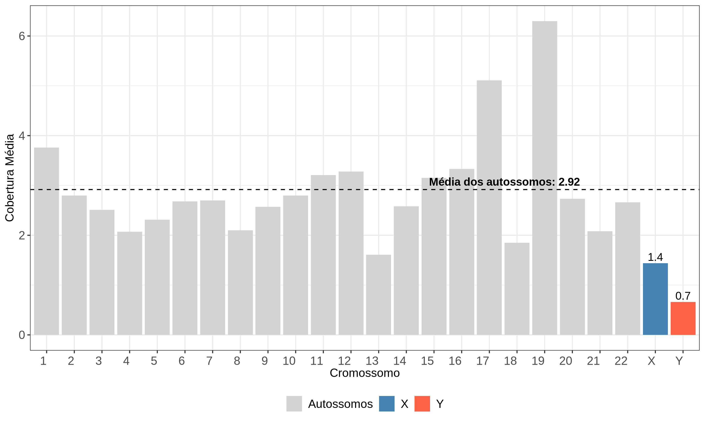

# WES-QC: Whole Exome Sequencing Quality Control Pipeline
  
Bioinformatic challenge : Automated quality control pipeline for Whole Exome Sequencing (WES) data - Desafio Técnico Bioinformata

## Author
👨🏽‍💻 Alexandre Junio Borges Araujo  
📧 alexandrejunio@usp.br  
▶️ LinkedIn: https://www.linkedin.com/in/alexandre-borges-57bb14150/

# WES Quality Control Pipeline

Pipeline automatizado de controle de qualidade para dados de Whole Exome Sequencing (WES), com foco no cálculo de cobertura, inferência de sexo genético e estimativa de contaminação. Este projeto faz parte de um desafio técnico com base na amostra NA06994 do 1000 Genomes Project.

## 🔬 Amostra utilizada

- **Nome**: NA06994
- **Origem**: Projeto 1000 Genomes – CEU
- **Formato**: `.cram` + `.crai`
- **Referência**: GRCh38_full_analysis_set_plus_decoy_hla.fa

## 📁 Peparação e Estrutura repositório
Este repositório organiza os arquivos e scripts utilizados em um pipeline de controle de qualidade e análise exploratória. A seguir, descreve-se a estrutura e a função de cada diretório e os principais arquivos:

wes_challenge_incor/  
├── data/                        
├── environment.yaml             
├── environment_verifybamid.yaml  
├── logs/                        
├── results/                      
├── scripts/                   
└── README.md                       

**onde:**  
**data/**: Contém os dados de entrada utilizados no pipeline, incluindo arquivos .cram, .bam, .vcf, .bed e o genoma de referência em formato .fa.  
**environment.yaml**: Arquivo para criação do ambiente Conda principal, com as dependências gerais do pipeline (R, mosdepth, samtools etc.).  
**environment_verifybamid.yaml**: Ambiente específico contendo apenas os pacotes necessários para execução do verifyBamID2.  
**logs/**: Diretório onde são armazenados os arquivos de log gerados por cada etapa, facilitando a verificação e depuração do pipeline.  
**results/**: Diretório com as saídas das análises, incluindo tabelas, gráficos, logs de inferência de sexo, e resultados do verifyBamID2.  
**scripts/**: Scripts automatizados em Bash e R responsáveis por cada etapa da análise (download, cobertura, conversão, visualização etc.).  
**README.md**: Documento com instruções, estrutura e explicações sobre o funcionamento e execução do pipeline.

## Configuração dos ambientes necessários  
* [environment.yaml](environment.yaml) — Ambiente principal  
* [environment_verifybamid.yaml](environment_verifybamid.yaml) — Ambiente para uso do verifyBamID
  
Foi criado um ambiente exclusivo para usar o verifybamID devido sua necessidade de depêndencias específicas que podem conflitar com as utilizadas no ambiente principal.

---
## Etapa 0 — Download dos arquivos necessários:
Para a execução deste pipeline, foram necessários três arquivos públicos obtidos a partir de repositórios oficiais. Esses arquivos são essenciais para garantir a padronização e a reprodutibilidade das análises:  

**Arquivo de alinhamento (.cram):** [GRCh38DH.20150826.CEU.exome.cram](http://ftp.1000genomes.ebi.ac.uk/vol1/ftp/data_collections/1000_genomes_project/data/CEU/NA06994/exome_alignment/NA06994.alt_bwamem_GRCh38DH.20150826.CEU.exome.cram)  
**Índice do alinhamento (.cram.crai):** [GRCh38DH.20150826.CEU.exome.cram.crai](http://ftp.1000genomes.ebi.ac.uk/vol1/ftp/data_collections/1000_genomes_project/data/CEU/NA06994/exome_alignment/NA06994.alt_bwamem_GRCh38DH.20150826.CEU.exome.cram.crai)  
**Arquivo de regiões exônicas (.bed):**[hg38_exome_v2.0.2_targets_validated.re_annotated.bed](https://www.twistbioscience.com/sites/default/files/resources/2022-12/hg38_exome_v2.0.2_targets_sorted_validated.re_annotated.bed)  

Os arquivos foram baixados de repositórios públicos e utilizados como entrada para as etapas de cálculo de cobertura e análise exploratória.

---
## Etapa 1 — Análise de Cobertura do Exoma
Este pipeline realiza o cálculo da cobertura de regiões exônicas utilizando o software Mosdepth e a análise exploratória dos resultados em R.  

### 1.1 — Cálculo de Cobertura com Mosdepth
O cálculo da cobertura das regiões exônicas foi realizado com o software Mosdepth, utilizando como entrada o arquivo _.cram_ da amostra, o arquivo _.bed_ com as regiões-alvo do exoma e o genoma de referência completo (incluindo decoy e regiões HLA).

A execução foi feita via script _coverage_mosdepth.sh_, que inclui a instrução set -e para interromper automaticamente o pipeline em caso de erro, garantindo a integridade da análise.

**Ambiente:**  
wes_qc_env

**Script:**  
scripts/coverage_mosdepth.sh

**Requisitos:**  
Mosdepth  
Arquivo CRAM: data/NA06994.alt_bwamem_GRCh38DH.20150826.CEU.exome.cram  
Índice CRAI correspondente  
Referência: data/GRCh38_full_analysis_set_plus_decoy_hla.fa  
Regiões-alvo: data/hg38_exome_v2.0.2_targets_sorted_validated.re_annotated.bed

**Estrutura Esperada para Execução:**  
wes_challenge_incor/  
├── data/  
│   ├── NA06994.alt_bwamem_GRCh38DH.20150826.CEU.exome.cram       
│   ├── NA06994.alt_bwamem_GRCh38DH.20150826.CEU.exome.cram.crai   
│   ├── GRCh38_full_analysis_set_plus_decoy_hla.fa               
│   ├── GRCh38_full_analysis_set_plus_decoy_hla.fa.fai           
│   └── hg38_exome_v2.0.2_targets_sorted_validated.re_annotated.bed  
│  
├── scripts/  
│   └── coverage_mosdepth.sh  
│  
├── results/  
│  
├── logs/   

**Execução:**  
bash scripts/coverage_mosdepth.sh

**Saídas esperadas:**  
results/NA06994.regions.bed.gz: Profundidade por região exônica  
results/NA06994.mosdepth.summary.txt: Estatísticas resumidas de cobertura  
logs/cobertura_mosdepth.log: Log de execução  

**Resultaddos gerados na amostra NA06994:**    
[Mon May 12 21:17:52 -03 2025] Iniciando cálculo de cobertura com mosdepth...  
Usando 4 threads e referência: data/GRCh38_full_analysis_set_plus_decoy_hla.fa  
[Mon May 12 21:20:04 -03 2025] Cálculo de cobertura concluído com sucesso.  

### 1.2 — Análise Exploratória da Cobertura
A análise exploratória foi realizada com funções nativas da linguagem R, utilizando como entrada o arquivo .bed.gz gerado pelo Mosdepth. O script calcula métricas estatísticas de cobertura e gera uma visualização gráfica da distribuição dos dados.

**Ambiente:**  
wes_qc_env

**Script:**  
scripts/exploratory_analysis_coverage.R

**Requisitos:**  
R ≥ 4.0  
Pacotes: readr, dplyr, stringr, ggplot2  
Arquivo de entrada: results/NA06994.regions.bed.gz

**Estrutura Esperada para Execução:**  
wes_challenge_incor/  
├── results/  
│   └── NA06994.regions.bed.gz  
│  
├── scripts/  
│   └── exploratory_analysis_coverage.R  
│  
├── logs/         

**Execução:**
Rscript scripts/exploratory_analysis_coverage.R results/NA06994.regions.bed.gz

**Saídas esperadas:**
results/exploratory_analysis_coverage.csv  
results/histogram_coverage.png  
logs/exploratory_analysis_coverage.log  

**Resultaddos gerados na amostra NA06994:**  
[INFO] Loading input file: ../results/NA06994.regions.bed.gz  
[INFO] Calculating coverage statistics...  
[INFO] Summary written to: ../results/exploratory_analysis_coverage.csv  
========== Coverage Summary ==========  
metric      
Mean Depth:   64.16930  
Minimum Depth:    0.00000  
Maximum Depth: 3371.81000  
Regions with Coverage ≥ 10x (%):   71.76290  
Regions with Coverage ≥ 30x (%):   61.21708  

  

**CONCLUSÃO:**  
A amostra apresentou uma profundidade média de 64,17×, indicando cobertura robusta para análise de variantes em regiões exônicas. Além disso, 71,76% das regiões apresentaram cobertura igual ou superior a 10×, e 61,22% foram cobertas por pelo menos 30×, valores que indicam boa qualidade para chamadas de variantes com alta confiança. Apesar de adequada, a cobertura não é uniforme, o que reforça a importância de avaliar graficamente a distribuição.

---
## Etapa 2 — Inferência do Sexo Genético
A inferência de sexo genético foi realizada com base na cobertura dos cromossomos sexuais, utilizando os arquivos de saída do _mosdepth_ (_.mosdepth.summary.txt_). Diferentemente de abordagens baseadas exclusivamente no exoma, este método considera a cobertura de todos os cromossomos (X e Y) em comparação à cobertura média dos autossomos. A classificação é realizada por meio de limiares empíricos fixos aplicados à razão entre cobertura dos cromossomos sexuais e autossomos, sem uso de inferência bayesiana, como ocorre em ferramentas como o _seGMM_ (Liu et al. 2022).

Todos os scripts estão organizados no diretório scripts/. As saídas são organizadas em logs/ e results/.

**Ambiente:**  
wes_qc_env

**Script:**  
scripts/sex_inference.R

**Requisitos:**  
R ≥ 4.0  
Pacotes: ggplot2, readr, dplyr, stringr  
Arquivo de entrada: results/<sample>.mosdepth.summary.txt

**Lógicas de Classificação Utilizadas:**  
chrX ≈ 2× autosomos, chrY ≈ 0 =	Female (XX)  
chrX ≈ 1× autosomos, chrY ≈ 1× autosomos	= Male (XY)  
chrX ≈ 2× autosomos, chrY elevado	= Possível aneuploidia (XXY)  
chrX ≈ 1× autosomos, chrY ≈ 0	= Possível aneuploidia (X0)  
Caso intermediário ou ambíguo	= Indeterminado  

x_female_lower_threshold <- 0.8  
x_male_upper_threshold <- 0.6  
y_male_lower_threshold <- 0.1  

**Estrutura Esperada para Execução:**  
wes_challenge_incor/  
├── results/  
│   └── NA06994.mosdepth.summary.txt   
│  
├── scripts/  
│   └── sex_inference.R    
│  
├── logs/  

**Execução:**  
Rscript scripts/sex_inference.R <sample_name>

**Saídas esperadas:**  
* results/NA06994_chrXY_coverage.png: Gráfico de barras com a cobertura média por cromossomo.  
* results/NA06994_chrXY_coverage.log: Log contendo razão de cobertura, médias e sexo inferido.

**Resultaddos gerados na amostra NA06994:**  
  
=== Genetic Sex Inference ===  
Sample: NA06994  
Average autosome coverage: 2.92  
chrX coverage: 1.44 ( 0.49 x autosomes)  
chrY coverage: 0.66 ( 0.23 x autosomes)  
Inferred sex: Male (XY)  

**CONCLUSÃO:**  
A razão entre a cobertura do cromossomo X e os autossomos foi de 0,49, indicando a presença de apenas um cromossomo X. A cobertura observada no cromossomo Y foi de 0,23× em relação aos autossomos, sugerindo a presença do cromossomo Y. Com base nesses valores, a amostra NA06994 foi classificada como tendo sexo genético masculino (XY).

---
## Etapa 3 — Verificação de Contaminação
O análisde de contaminação foi realizada com verifyBamID. Essa escolha se baseou na robustez estatística (inferência Bayesiana otimizada), adequação ao tipo de dado, e uso amplo na comunidade científica. Mais informações poderão se checadas em Jun G. et al. (2012)

Como o verifyBamID necessita de arquivos .bam. Foram realizados os dois processos consecutivos:  
* Conversão de arquivos _.cram_ para _.bam_ com indexação  
* Verificação de contaminação genômica com _verifyBamID2_  

Todos os scripts estão organizados no diretório scripts/. As saídas são organizadas em logs/ e results/.

### 3.1 — Conversão de CRAM para BAM
Arquivos .cram de amostras de exoma são convertidos para .bam com uso de referência genômica completa. Cada .bam é também indexado (.bai) e os logs são salvos separadamente.

**Ambiente:**  
wes_qc_env

**Script:**  
scripts/convert_cram_to_bam.sh

**Requisitos:**  
samtools ≥ v1.10  
Arquivo CRAM: data/NA06994.alt_bwamem_GRCh38DH.20150826.CEU.exome.cram   
Arquivo FASTA de referência com .fai (ex: GRCh38_full_analysis_set_plus_decoy_hla.fa)

**strutura Esperada para Execução:**  
wes_challenge_incor/  
├── data/  
│   ├── NA06994.alt_bwamem_GRCh38DH.20150826.CEU.exome.cram      
│   ├── GRCh38_full_analysis_set_plus_decoy_hla.fa              
│   └── GRCh38_full_analysis_set_plus_decoy_hla.fa.fai         
│  
├── scripts/  
│   └── convert_cram_to_bam.sh                               
│  
├── results/                                                    
│  
├── logs/      

**Execução:**   
./scripts/convert_cram_to_bam.sh

**Saídas esperadas:**
* data/<sample>.bam
* data/<sample>.bam.bai
* logs/<sample>_convert.log

**Arquivos gerados na amostra NA06994:**
* NA06994.bam   
* NA06994.bam.bai
* NA06994_convert.log

### 3.2 — Verificação de Contaminação com verifyBamID
Utiliza verifyBamID para estimar contaminação com base em variantes de um VCF de referência populacional. Utiliza também um arquivo .bed das regiões exônicas.

**Ambiente:**  
verifybamID_env

**Script:**  
scripts/contamination_verifybamid.sh

**Requisitos:**
* verifyBamID ≥ v1.1.3  
* Arquivo BAM: data/NA06994.bam  
* Arquivo .bai: data/NA06994.bam.bai  
* Arquivo VCF filtrado com variantes bialélicas comuns: data/hapmap_filtered.vcf.gz  
* Índice .csi do VCF: data/hapmap_filtered.vcf.gz.csi  
* Arquivo BED com regiões-alvo do exoma (opcional, se usado no script):   

**Estrutura Esperada para Execução:**  
wes_challenge_incor/  
├── data/  
│   ├── NA06994.bam                            
│   ├── NA06994.bam.bai                         
│   ├── hapmap_filtered.vcf.gz                   
│   ├── hapmap_filtered.vcf.gz.csi                
│  
├── scripts/  
│   └── contamination_verifybamid.sh            
│  
├── results/                                    
│  
├── logs/      

  
**Execução:**  
./scripts/contamination_verifybamid.sh <sample_name>

**Saídas esperadas:**
* results/<sample>_verifybam.selfSM
* results/<sample>_verifybam.depthSM
* logs/verifybamid_<sample>.log

**Arquivos gerados na amostra NA06994:**  
NA06994_verifybam.depthSM: Este arquivo registra a profundidade de cobertura (DP) da amostra em cada posição do VCF analisado. É útil para diagnósticos e para entender a distribuição da profundidade nas regiões genotipadas.  

NA06994_verifybam.selfSM: Este arquivo contém as estimativas de contaminação genômica e ancestralidade da amostra, com base na comparação entre o BAM analisado e o painel de variantes de referência (VCF). A coluna _FREEMIX_ determina a fração estimada de contaminação.  

**CONCLUSÃO:**  
A amostra NA06994 apresentou uma estimativa de contaminação (_FREEMIX_) de 0,00035, ou seja, 0,035%. Esse valor está muito abaixo do limite de tolerância geralmente aceito (2%), indicando que não há evidência de contaminação significativa na amostra. Portanto, os dados podem ser considerados confiáveis para análises genômicas subsequentes.

---
## Referências:
Liu, S., Zeng, Y., Wang, C., Zhang, Q., Chen, M., Wang, X., ... & Bu, F. (2022). seGMM: A new tool for gender determination from massively parallel sequencing data. Frontiers in Genetics, 13, 850804.  
Jun, G., Flickinger, M., Hetrick, K. N., Romm, J. M., Doheny, K. F., Abecasis, G. R., ... & Kang, H. M. (2012). Detecting and estimating contamination of human DNA samples in sequencing and array-based genotype data. The American Journal of Human Genetics, 91(5), 839-848.
